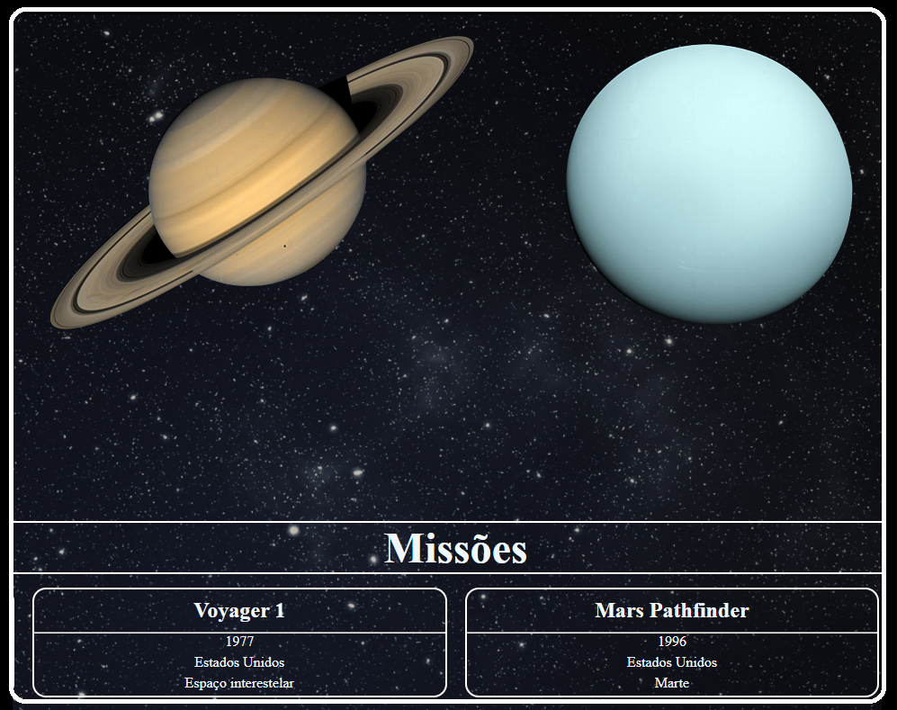

# Sistema-Solar [(Link do Projeto)](https://leandroteixeira.github.io/Sistema-Solar)
Projeto Sistema Solar desenvolvido em Janeiro de 2022, durante o módulo de Front End do curso da Trybe.

## Descrição
Trata-se de um projeto pequeno visando usar habilidades recém-adquiridas em React para exibir a lista dos planetas e suas missões espaciais.

## Habilidades usadas
* Criação e Desenvolvimento de Componentes em React
* Uso de Props
* Uso de PropTypes para validação das props

### [Link para o restante do portfolio](https://leandroteixeira.github.io)
